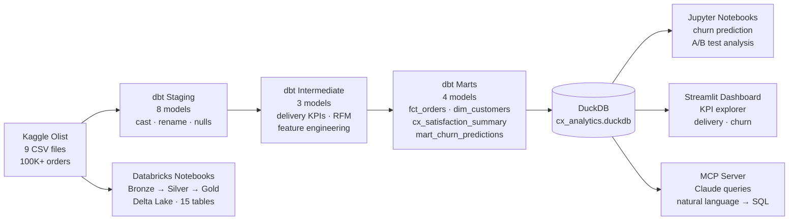

# CX Analytics Platform

> End-to-end customer experience analytics: dbt pipeline → Databricks Delta Lake → AI-powered querying → interactive dashboard

[](https://www.getdbt.com/)
[](https://duckdb.org/)
[](https://databricks.com/)
[](https://spark.apache.org/)
[](https://python.org/)
[](https://xgboost.readthedocs.io/)
[](https://streamlit.io/)
[](https://modelcontextprotocol.io/)

## What this project demonstrates

| Skill | Implementation |
|---|---|
| **dbt** | 13 models across 3 layers (staging → intermediate → marts), 40 automated quality tests |
| **Databricks / Spark SQL** | Medallion architecture (Bronze → Silver → Gold), 15 Delta Lake tables, window functions, Delta time travel |
| **Python / ML** | XGBoost + Random Forest churn prediction, feature engineering in dbt, 0.979 recall on retained customers |
| **SQL** | Advanced window functions, multi-step CTEs, cohort analysis, correlated subqueries — see `sql/advanced_queries.sql` |
| **MCP + Claude** | AI agent that queries the analytics database in natural language via 6 structured tools |
| **Streamlit** | Interactive KPI dashboard: monthly trends, delivery by state, churn risk explorer |

---

## Architecture



See [`docs/architecture.md`](docs/architecture.md) for the full diagram, schema reference, and design decisions.

---

## Key business insights

Analysis of **99,441 orders** across 3 years (2016–2018):

1. **Delivery time is the dominant satisfaction driver** — orders arriving 3+ days late score 4+ stars at only 52% vs. 89% for orders delivered on time. The correlation is visible across all 27 Brazilian states.
2. **97.8% of customers are one-time buyers** — Olist is structurally a single-purchase marketplace. The 2.2% who reorder are measurably different: higher average spend, shorter delivery times, and higher satisfaction scores.
3. **Random Forest identifies 97.9% of retained customers** (recall = 0.979) — `days_since_last_order` dominates feature importance, consistent with RFM theory. The model threshold (0.303) is well-calibrated; XGBoost and LR produce extreme thresholds (0.999 / 0.006) suggesting overfitting.
4. **States in the North and Northeast (AM, RR, AP) average 25+ delivery days** vs. 8 days for SP — a 3× gap that directly explains their lower CSAT rates and higher churn probability in those regions.

---

## dbt Model Layers

| Layer | Models | Purpose |
|---|---|---|
| **Staging** | `stg_orders`, `stg_customers`, `stg_order_items`, `stg_order_reviews`, `stg_order_payments`, `stg_products`, `stg_sellers`, `stg_geolocation` | Rename columns, cast types, coalesce nulls |
| **Intermediate** | `int_orders_enriched`, `int_customer_orders`, `int_churn_features` | Delivery KPIs, review joins, customer-level aggregation, ML feature engineering |
| **Marts** | `fct_orders`, `dim_customers`, `cx_satisfaction_summary`, `mart_churn_predictions` | Reporting-ready tables with segments, monthly KPIs, and churn scores |

All models include `not_null` and `unique` tests on primary keys. Run `dbt test` to verify all 40 pass.

---

## Churn Model

### Problem framing

Olist is structurally a single-purchase marketplace — 97.8% of customers never reorder. The goal is not to predict churn (near-universal) but to identify the rare customers who exhibit repeat behaviour — the ones worth targeting for retention spend.

**Label:** `churned = 1` if no orders in the past 180 days; `retained = 0` otherwise.

### Model comparison

| Model | ROC-AUC | F1 Retained | Recall Retained | Threshold |
|---|---|---|---|---|
| Logistic Regression | 1.000 | 0.9247 | 0.8958 | 0.006 |
| **Random Forest** | **1.000** | **0.9895** | **0.9792** | **0.303** |
| XGBoost | 1.000 | 0.9792 | 0.9792 | 0.999 |

**Selected model: Random Forest.** Threshold 0.303 is the most calibrated — LR's 0.006 and XGBoost's 0.999 produce extreme probabilities rather than meaningful scores.

### Features (engineered in dbt before ML)

`days_since_last_order` · `days_since_first_order` · `order_frequency_segment` · `satisfaction_segment` · average review score · avg days to deliver · on-time delivery count

---

## Project Structure

```
cx-analytics-pipeline/
├── models/
│   ├── staging/               # 8 source-aligned models (stg_*)
│   ├── intermediate/          # 3 enrichment models (int_*)
│   └── marts/
│       └── customer_experience/   # 4 reporting models
├── databricks/
│   ├── notebooks/
│   │   ├── 01_bronze_ingest.py    # Raw CSV → 9 Delta Lake tables
│   │   ├── 02_silver_transform.py # Joins · delivery KPIs · ML features
│   │   └── 03_gold_kpis.py        # Business-ready KPI aggregations
│   └── README.md                  # Databricks setup guide
├── mcp/
│   ├── server.py              # MCP server: 6 tools over DuckDB
│   ├── audit_logger.py        # Per-query audit trail
│   ├── data_masker.py         # PII masking decorator
│   ├── config.json            # Claude Desktop config template
│   └── README.md              # Setup + example prompts
├── streamlit/
│   ├── app.py                 # Multi-tab KPI dashboard
│   └── requirements.txt
├── sql/
│   └── advanced_queries.sql   # 7 advanced SQL patterns with business context
├── notebooks/
│   ├── churn_prediction.ipynb          # RF + XGBoost + LR comparison
│   └── ab_test_delivery_vs_satisfaction.ipynb
├── docs/
│   └── architecture.md        # Architecture diagram + schema reference
├── tests/                     # Singular + generic dbt tests
├── macros/                    # Reusable Jinja helpers
├── seeds/                     # Static reference data
└── data/
    └── raw/                   # Olist CSVs (gitignored — download from Kaggle)
```

---

## Quick Start

### 1. Clone and set up

```bash
git clone https://github.com/amateeraasu/cx-analytics-pipeline.git
cd cx-analytics-pipeline
python3.10 -m venv .venv && source .venv/bin/activate
pip install -r requirements.txt
```

### 2. Download the Olist dataset

```bash
kaggle datasets download -d olistbr/brazilian-ecommerce -p data/raw/ --unzip
```

Or download manually from [Kaggle](https://www.kaggle.com/datasets/olistbr/brazilian-ecommerce) and place all CSVs in `data/raw/`.

### 3. Run the dbt pipeline

```bash
dbt deps --profiles-dir .
dbt run  --profiles-dir .
dbt test --profiles-dir .    # all 40 tests should pass

dbt docs generate --profiles-dir . && dbt docs serve --profiles-dir .
```

### 4. Generate churn predictions (optional)

```bash
jupyter notebook notebooks/churn_prediction.ipynb
```

Writes `data/churn_predictions.csv` — required for the churn tab in the dashboard and `mart_churn_predictions` in DuckDB.

### 5. Launch the Streamlit dashboard

```bash
pip install -r streamlit/requirements.txt
streamlit run streamlit/app.py
```

### 6. Connect the MCP server to Claude

```bash
pip install -r mcp/requirements.txt
```

See [`mcp/README.md`](mcp/README.md) for Claude Desktop configuration and example prompts.

### 7. Run Databricks notebooks (optional)

See [`databricks/README.md`](databricks/README.md) for setup on Databricks Community Edition (free).

---

## Advanced SQL showcase

`sql/advanced_queries.sql` contains 7 standalone queries demonstrating:

- **LAG + period-over-period delta** — month-over-month CSAT and GMV change
- **Running totals** — cumulative revenue with `SUM OVER (ROWS BETWEEN UNBOUNDED PRECEDING AND CURRENT ROW)`
- **NTILE + PERCENT_RANK** — customer spending percentiles and decile segmentation
- **Bucketed aggregation** — delivery speed vs. satisfaction impact analysis
- **Cohort retention** — first-purchase cohort analysis with `ROW_NUMBER` and self-join
- **Composite scoring** — churn retention priority with weighted business formula
- **PARTITION BY ranking** — seller performance ranked within product category using `RANK() OVER (PARTITION BY ...)`

---

## Data Source

[Olist Brazilian E-Commerce Dataset](https://www.kaggle.com/datasets/olistbr/brazilian-ecommerce) — 99,441 orders from 2016–2018, released under CC BY-NC-SA 4.0. Raw CSVs are gitignored and must be downloaded separately.

---

## About

Built by **Azhar Kudaibergen** — Analytics Engineer focused on dbt, DuckDB, Python, and AI-augmented analytics.

[LinkedIn](https://linkedin.com/in/azhar-kudaibergen) · [GitHub](https://github.com/amateeraasu)
