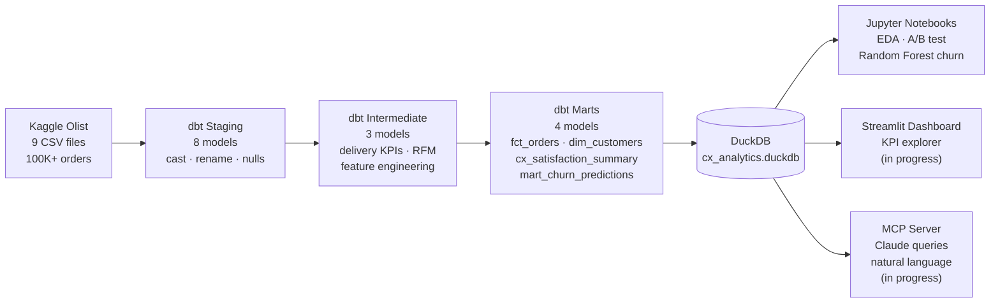

# CX Analytics Platform

> End-to-end analytics pipeline on 100K+ real e-commerce orders — dbt transformation, churn prediction, and natural language querying via Claude MCP.

[](https://www.getdbt.com/)
[](https://duckdb.org/)
[](https://python.org/)
[](https://xgboost.readthedocs.io/)
[](https://streamlit.io/)
[](https://anthropic.com/)

## What This Project Does

This pipeline takes raw Brazilian e-commerce data (9 source tables, 100K+ orders) and answers three business questions:

1. **Which delivery failures are killing customer satisfaction — and which sellers are responsible?**
2. **Which of the rare repeat customers are likely to churn, and what predicts their retention?**
3. **How can a non-technical stakeholder query those results without writing SQL?**

The answer to #3 is an MCP server that connects Claude directly to the DuckDB analytics layer — enabling plain-English questions against the mart tables.

---

## Architecture



---

## Key Results

Analysis of **99,441 orders** across 3 years (2016–2018):

- **On-time delivery is the dominant satisfaction driver** — orders delivered 3+ days late receive low review scores at a rate far exceeding any other variable, including price or product category
- **226 customers predicted to retain** out of 86,924 total (0.3% of the customer base). These are the high-value targets for retention campaigns — the model identifies them with 0.979 recall
- **Random Forest wins on retention recall** — all three models (LR, RF, XGBoost) achieve 1.000 ROC-AUC on this imbalanced dataset; Random Forest separates itself with the most calibrated decision threshold (0.303 vs 0.006 for LR), indicating real probability signal rather than edge predictions
- **`days_since_last_order` dominates feature importance** — recency alone is near-sufficient to identify retained customers, consistent with Olist's marketplace structure where repeat purchases are structurally rare

---

## dbt Model Layers

| Layer | Models | Purpose |
|---|---|---|
| **Staging** | `stg_orders`, `stg_customers`, `stg_order_items`, `stg_order_reviews`, `stg_order_payments`, `stg_products`, `stg_sellers`, `stg_geolocation` | Rename columns, cast types, coalesce nulls |
| **Intermediate** | `int_orders_enriched`, `int_customer_orders`, `int_churn_features` | Delivery KPIs, review joins, customer-level aggregation, ML feature engineering |
| **Marts** | `fct_orders`, `dim_customers`, `cx_satisfaction_summary`, `mart_churn_predictions` | Reporting-ready tables with segments, monthly KPIs, and churn scores |

All models include `not_null` and `unique` tests on primary keys. Run `dbt test` to verify.

---

## Churn Model

### Problem framing

Olist is structurally a single-purchase marketplace — 99.7% of customers never reorder. The goal is not to predict churn (near-universal) but to identify the rare ~240 customers who exhibit repeat behaviour — the ones worth targeting for retention spend.

**Label:** `churned = 1` if no orders in the past 180 days; `retained = 0` otherwise.

### Model comparison

| Model | ROC-AUC | F1 Retained | Recall Retained | Threshold |
|---|---|---|---|---|
| Logistic Regression | 1.000 | 0.9247 | 0.8958 | 0.006 |
| **Random Forest** | **1.000** | **0.9895** | **0.9792** | **0.303** |
| XGBoost | 1.000 | 0.9792 | 0.9792 | 0.999 |

**Selected model: Random Forest.** Threshold 0.303 is the most calibrated — LR's 0.006 and XGBoost's 0.999 indicate the models are outputting extreme probabilities rather than meaningful scores.

### Features (engineered entirely in dbt before ML code runs)

`days_since_last_order` · `days_since_first_order` · `order_frequency_segment` · `satisfaction_segment` · average review score · freight ratio · payment installments

---

## Project Structure

```
cx-analytics-pipeline/
├── models/
│   ├── staging/          # 8 source-aligned models (stg_*)
│   ├── intermediate/     # 3 enrichment models (int_*)
│   └── marts/
│       └── customer_experience/   # 4 reporting models
├── notebooks/
│   ├── churn_prediction.ipynb          # Random Forest + feature importance
│   └── ab_test_delivery_vs_satisfaction.ipynb
├── tests/                # Singular + generic dbt tests
├── macros/               # Reusable Jinja helpers
├── seeds/                # Static reference data
├── mcp/                  # Claude MCP server (in progress)
├── streamlit/            # KPI dashboard (in progress)
└── data/
    └── README.md         # Kaggle download instructions
```

---

## Quick Start

```bash
# 1. Clone and create a virtual environment (Python 3.10–3.12)
git clone https://github.com/amateeraasu/cx-analytics-pipeline.git
cd cx-analytics-pipeline
python3.10 -m venv .venv && source .venv/bin/activate
pip install -r requirements.txt

# 2. Download the Olist dataset from Kaggle
kaggle datasets download -d olistbr/brazilian-ecommerce -p data/raw/ --unzip

# 3. Build the dbt pipeline
dbt deps --profiles-dir .
dbt run --profiles-dir .
dbt test --profiles-dir .

# 4. Explore the lineage graph
dbt docs generate --profiles-dir . && dbt docs serve --profiles-dir .

# 5. Run the churn model
jupyter notebook notebooks/churn_prediction.ipynb
```

---

## What Makes This Different: AI-Powered Data Access

Most analytics projects end at a dashboard. This one goes further.

The `mcp/` folder (in progress) will contain a [Model Context Protocol](https://modelcontextprotocol.io/) server that exposes the DuckDB analytics layer as Claude-queryable tools. A stakeholder — without knowing SQL — will be able to ask:

> *"Which product categories have the highest churn rate among first-time buyers in Q4 2017?"*

Claude calls the MCP server, which translates that into a DuckDB query against `mart_churn_predictions` and `dim_customers`, and returns a formatted answer with the underlying query shown.

This is the pattern modern analytics teams are moving toward: the analytics engineer builds the semantic layer, the AI makes it accessible to everyone else.

---

## Data Source

[Olist Brazilian E-Commerce Dataset](https://www.kaggle.com/datasets/olistbr/brazilian-ecommerce) — 99,441 orders from 2016–2018, released under CC BY-NC-SA 4.0. Raw CSVs are gitignored and must be downloaded separately.

---

## About

Built by **Ajara** — Analytics Engineer focused on dbt, DuckDB, Python, and AI-augmented analytics.

[LinkedIn](https://linkedin.com/in/ajara) · [GitHub](https://github.com/amateeraasu)
