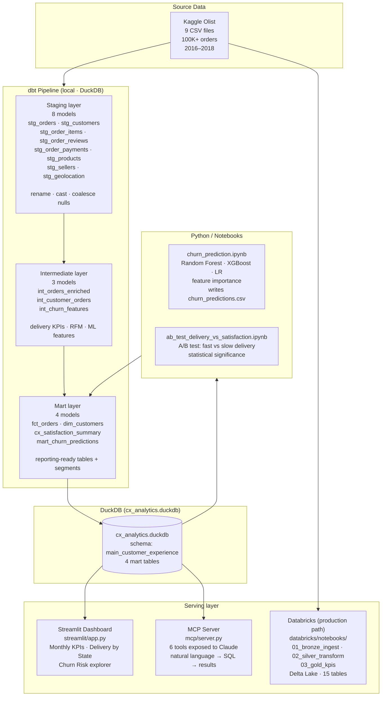

# CX Analytics Platform — Architecture

## Full data flow



---

## Layer-by-layer design decisions

### Why dbt?

dbt enforces separation of concerns — staging models are pure rename/cast operations, business logic lives in intermediate models, and marts are the only layer stakeholders or BI tools touch. Every layer is version-controlled SQL with automated `not_null` + `unique` tests on every primary key. The lineage graph (visible via `dbt docs serve`) makes impact analysis trivial.

**What it enables:** 40 automated tests that catch schema drift, data gaps, and referential integrity failures on every run.

### Why DuckDB locally?

No warehouse required, no cloud costs during development, and no credentials to manage. DuckDB runs in-process, reads directly from the Parquet/CSV sources via dbt's external file feature, and produces a single `.duckdb` file that the Streamlit app and MCP server both connect to. The same SQL dialect runs locally and in Databricks SQL, so migrating to a warehouse is a profiles.yml change.

**Tradeoff:** Single-writer limitation. For a production deployment with multiple writers, switch to a warehouse — the dbt models are adapter-agnostic.

### Why Delta Lake / Databricks?

The Databricks notebooks (`databricks/`) demonstrate the same pipeline in a production-grade Spark environment. Delta Lake adds:

- **ACID transactions** — concurrent writers without corruption
- **Time travel** — `SELECT * FROM table VERSION AS OF 3` for auditing and rollbacks
- **Schema enforcement + evolution** — rejects writes that break the schema; supports additive schema changes without rewriting the table
- **Z-ORDER indexing** — co-locate related data for fast partition pruning on high-cardinality columns like `order_id`

The medallion architecture (Bronze → Silver → Gold) mirrors the dbt layers: Bronze = raw ingest with metadata, Silver = cleaned + joined, Gold = business-ready aggregations.

### Why MCP?

Most analytics projects end at a dashboard. An MCP server transforms the mart layer into a natural language API — a stakeholder can ask _"Which states have the worst CSAT?"_ and get a structured answer without knowing SQL or opening a BI tool. The six tools expose pre-built, optimised queries for the most common analysis patterns; `run_sql` handles everything else.

**Security design:** Every user-supplied value is a parameterised `?` binding. The `group_by` dimension is validated against an allowlist. Date inputs are parsed with `datetime.date.fromisoformat()` (rejects injection payloads) and bounded to the dataset window. The DuckDB connection is opened in read-only mode — writes are structurally impossible regardless of the query.

### Why Streamlit?

Streamlit turns a Python script into a shareable interactive tool in under 200 lines. The dashboard serves the same audience as the MCP server but for users who prefer visual exploration over conversational queries. Both connect to the same DuckDB file — no ETL duplication.

---

## Table schemas

### `fct_orders`
One row per order. Central fact table.

| Column | Type | Description |
|---|---|---|
| `order_id` | VARCHAR | Olist order identifier |
| `customer_unique_id` | VARCHAR | Deduplicated customer ID |
| `customer_sk` | VARCHAR | Surrogate key joining to dim_customers |
| `order_status` | VARCHAR | delivered · shipped · canceled · etc. |
| `purchased_at` | TIMESTAMPTZ | Order purchase timestamp |
| `days_to_deliver` | INTEGER | Calendar days from purchase to delivery |
| `delivery_delta_days` | INTEGER | Actual minus estimated delivery date (negative = early) |
| `delivered_on_time` | BOOLEAN | True if delivered ≤ estimated date |
| `total_payment_value` | DOUBLE | BRL paid including freight |
| `primary_payment_type` | VARCHAR | credit_card · boleto · voucher · debit_card |
| `review_score` | INTEGER | 1–5 star rating |
| `order_month` | DATE | Truncated to month for easy aggregation |

### `dim_customers`
One row per unique customer (customer_unique_id grain).

| Column | Type | Description |
|---|---|---|
| `customer_sk` | VARCHAR | Surrogate key |
| `customer_unique_id` | VARCHAR | Deduplicated customer identifier |
| `state` / `city` | VARCHAR | Most recent address |
| `total_orders` | INTEGER | Lifetime order count |
| `total_spend_brl` | DOUBLE | Lifetime GMV in BRL |
| `avg_review_score` | DOUBLE | Lifetime average review |
| `avg_days_to_deliver` | DOUBLE | Lifetime average delivery time |
| `order_frequency_segment` | VARCHAR | one_time · repeat · loyal |
| `satisfaction_segment` | VARCHAR | satisfied · neutral · dissatisfied |
| `first_order_at` / `last_order_at` | TIMESTAMPTZ | Recency anchors |

### `cx_satisfaction_summary`
One row per calendar month. Used for all KPI trend charts.

| Column | Type | Description |
|---|---|---|
| `order_month` | DATE | Month start date |
| `total_orders` | INTEGER | Delivered orders in month |
| `csat_rate` | DOUBLE | Share of reviews scoring 4+ (0.0–1.0) |
| `on_time_rate` | DOUBLE | Share of deliveries on or before estimate |
| `avg_review_score` | DOUBLE | Mean review score |
| `avg_days_to_deliver` | DOUBLE | Mean delivery days |
| `total_gmv_brl` | DOUBLE | Gross merchandise value in BRL |

### `mart_churn_predictions`
One row per customer, churn probability from the ML model.

| Column | Type | Description |
|---|---|---|
| `customer_unique_id` | VARCHAR | Customer identifier |
| `churn_probability` | DOUBLE | Model output (0.0–1.0) |
| `churn_risk_tier` | VARCHAR | critical ≥0.85 · high ≥0.65 · medium ≥0.40 · low |
| `model_name` | VARCHAR | random_forest / xgboost / logistic_regression |
| All `dim_customers` columns | — | Joined for context |

---

## Running order

```
# Full local pipeline (10 minutes from scratch)
pip install -r requirements.txt
dbt deps --profiles-dir .
dbt run  --profiles-dir .
dbt test --profiles-dir .

# Optional: generate churn predictions
jupyter notebook notebooks/churn_prediction.ipynb

# Launch Streamlit dashboard
streamlit run streamlit/app.py

# Launch MCP server (then configure Claude Desktop — see mcp/README.md)
python mcp/server.py
```
